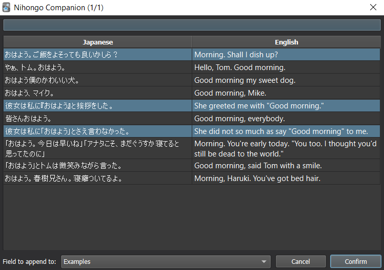

# Nihongo Companion

W.I.P. Anki addon to add japanese example sentences to decks.

Currently, the only supported dictionary is a web-scraping dictionary for [NihongoMaster](https://nihongomaster.com/), which has awesome sentences.

If you like it, please leave a positive review on the anki addon page!

## How to use

### Install the addon

Open anki, go to the Tools menu and then Add-ons>Browse & Install to paste in the code: `1946501448`.

### Add a field for examples

On your cards browser, select a card from the collection that you want to add examples, then click on "Fields..." and then "Add".

You can then add the field to the card's HTML, by selecting the card on the browser and clicking "Cards...", then add the following code to the front/back template:

```html
{{#Examples}}
<hr>Example(s)<br>

{{Examples}}
{{/Examples}}
```

The expected results are as follows:


### Add example sentences

First, open the browser and select the cards that you want to add the example sentences on. Then, on the toolbar, click "Nihongo Companion > Add example sentences to selected..."

Then, on the window, select the searching field from your note and click search.

**NOTE:** On NihongoMaster, searches usually work better with kana-only searches.


Then, select the desired word and click Confirm.

If any example sentences are found, you can select them.



Upon clicking "Confirm", the selected field will get filled with the selected examples.

**IMPORTANT**: As of yet, undo operations are not supported, so make sure to select the correct output field.

### TODO:
- Open card preview when searching
- Remember last choice on field dropdowns
- Highlight conjugated words
- Better search progress bars
