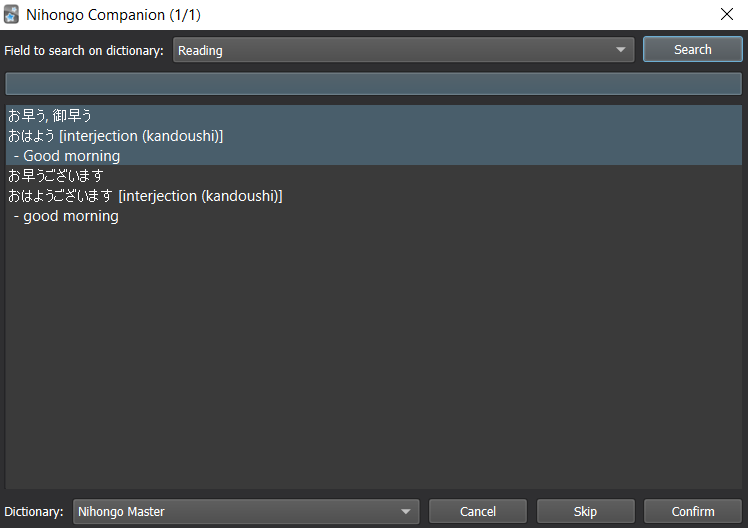

Currently, the supported dictionaries are:

* A web-scraping dictionary for [NihongoMaster](https://nihongomaster.com);
* A web-scraping dictionary for [Massif](https://massif.la);
* A local dictonary from [Monash.edu's sentence bank](https://users.monash.edu/~jwb/examples.utf.gz).

If you like it, please leave a positive review on the [anki addon page](https://ankiweb.net/shared/info/1946501448)!

## How to use

### Install the addon

Open anki, go to the Tools menu and then Add-ons>Browse & Install to paste in the code: `1946501448`. After Anki finishes installing the addon, restart it for changes to take effect.

### Add a field for examples

On your cards browser, select a card from the collection that you want to add examples, then click on "Fields..." and then "Add".

You can then add the field to the card's HTML, by selecting the card on the browser and clicking "Cards...", then add the following code to the front/back template:


```html
{{#Examples}}
<hr>Example(s)<br>

{{Examples}}
{{/Examples}}
```


The expected results are as follows:


### Add example sentences

First, open the browser and select the cards that you want to add the example sentences on. Then, on the toolbar, click "Nihongo Companion > Add example sentences to selected...", and a new window + card previewer should open.

On the window, select the searching field from your note. Some dictionaries require searches to confirm words before fetching examples, so if needed, click search and select the desired word.

**NOTE:** On NihongoMaster, searches usually work better with kana-only searches.



After clicking confirm, if any example sentences are found, you can select them.


Upon clicking "Confirm", the selected output field will get filled with the selected examples.

**IMPORTANT**: As of yet, undo operations are not supported, so make sure to select the correct output field.

### TODO:

- Highlight conjugated words
- Add new dictionaries
